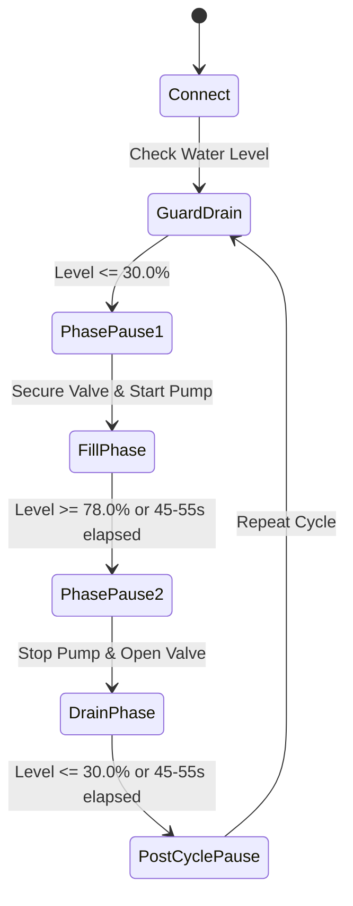
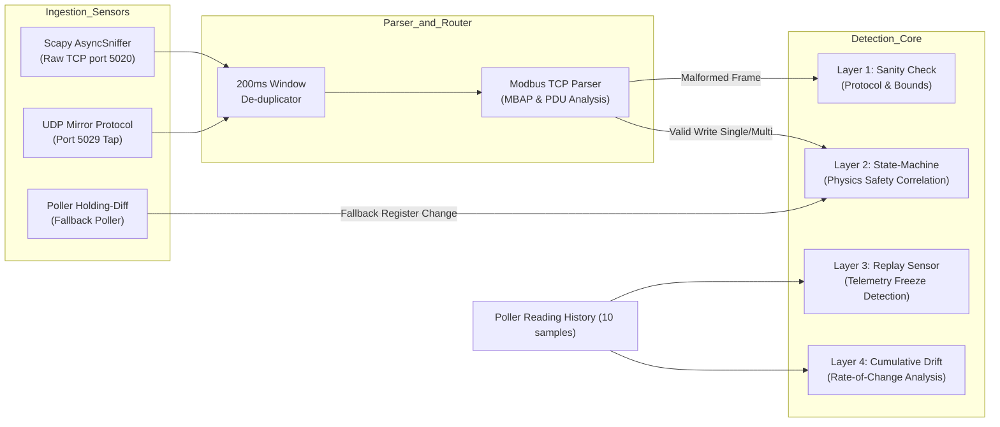
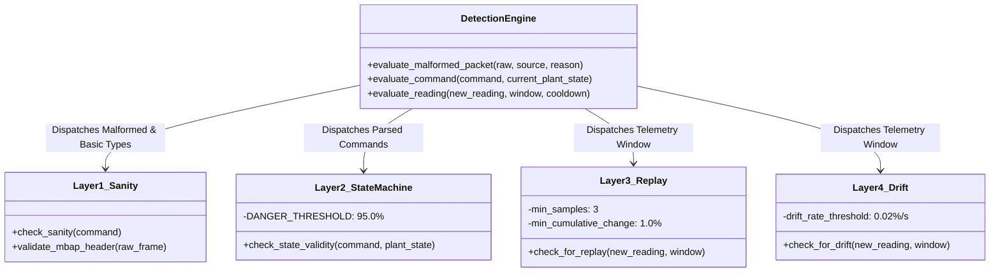
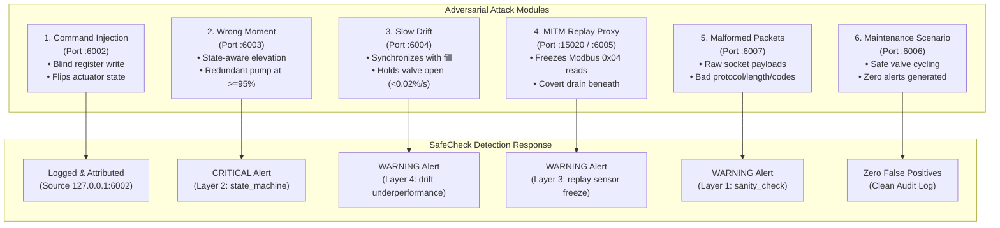
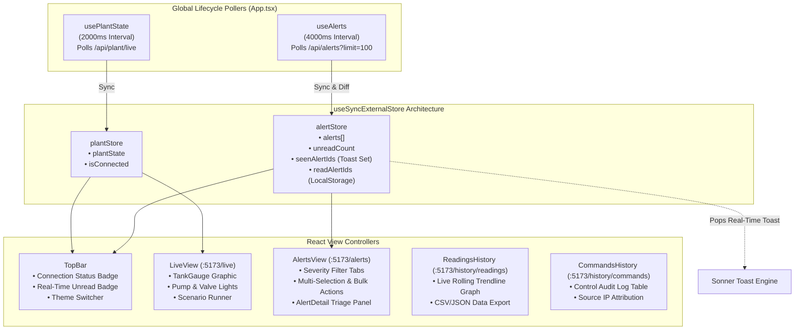

# SafeCheck — Industrial Intrusion Detection System

## Complete System Architecture & Technical Documentation

**Project:** SafeCheck | **Team:** SafeCheck_TrackE | **Competition:** ICSC Hackathon 2026  
**Status:** Complete Implementation & Verified Architecture

---

## Table of Contents

1. [Executive Summary & Hackathon Context](#1-executive-summary--hackathon-context)
2. [System Architecture & Data Flow Overview](#2-system-architecture--data-flow-overview)
3. [Module 1: Simulated Water Treatment Plant (`/plant`)](#3-module-1-simulated-water-treatment-plant-plant)
4. [Module 2: Autonomous Legitimate SCADA Operator (`/legitimate_client`)](#4-module-2-autonomous-legitimate-scada-operator-legitimate_client)
5. [Module 3: Multi-Layer Intrusion Detection Engine & Backend (`/backend`)](#5-module-3-multi-layer-intrusion-detection-engine--backend-backend)
6. [Module 4: Attack Demonstration Suite (`/attacks`)](#6-module-4-attack-demonstration-suite-attacks)
7. [Module 5: Real-Time SCADA Incident Response Dashboard (`/dashboard`)](#7-module-5-real-time-scada-incident-response-dashboard-dashboard)
8. [Unified Orchestration & System Verification](#8-unified-orchestration--system-verification)
9. [Technical Trade-offs, Defensive Innovations & Future Work](#9-technical-trade-offs-defensive-innovations--future-work)

---

## 1. Executive Summary & Hackathon Context

### 1.1 The Challenge

Industrial Control Systems (ICS) and Supervisory Control and Data Acquisition (SCADA) networks govern critical national infrastructure: water treatment plants, chemical refineries, electrical power grids, and manufacturing facilities. The underlying protocols—predominantly **Modbus TCP** (RFC 793 / Modbus-IDA)—were conceived in 1979 for isolated serial networks. By design, standard Modbus TCP exhibits zero native security controls:

- **No Authentication:** Any entity with TCP connectivity to port 5020 can issue actuation commands.
- **No Integrity Checking:** Packets contain no cryptographic signatures, checksums, or HMACs.
- **No Timestamps or Nonces:** Telemetry and commands are vulnerable to replay attacks.
- **Cleartext Transmission:** Modbus PDUs travel completely unencrypted over standard TCP/IP.

Traditional IT intrusion detection systems (IDS) rely on signature-based network filtering (e.g., Snort, Suricata). In industrial OT environments, signature inspection fails completely against adversaries who issue **syntactically valid, well-formed commands** that violate the **physical laws and operational state** of the plant.

### 1.2 The SafeCheck Solution

**SafeCheck** is an advisory, non-disruptive, physics-correlated intrusion detection system purpose-built for industrial control environments. Rather than acting as an active in-line firewall—which risks causing accidental plant shutdowns (spurious trips) that could cost utilities millions of dollars—SafeCheck sits as a passive observer on the operational technology (OT) network.

SafeCheck correlates incoming digital network traffic (Modbus TCP write requests) with live physical telemetry (sensor readings) across a **4-layer detection engine**:

1. **Layer 1 (Sanity Check):** Strict Modbus frame and MBAP header validation catching malformed packets, invalid protocol IDs, and out-of-range registers.
2. **Layer 2 (State-Machine Physics):** Physics-based safety rules evaluating commands against live water levels and actuator configurations to block catastrophic overflow/overpressure states.
3. **Layer 3 (Replay Detection):** Physical correlation heuristics identifying frozen sensor telemetry while physical actuators remain energized (e.g., Stuxnet-style sensor masking).
4. **Layer 4 (Drift Detection):** Cumulative differential analysis detecting covert rate-of-change anomalies, equipment starvation, and stealthy fluid leaks.

---

## 2. System Architecture & Data Flow Overview

The SafeCheck platform consists of five modular subsystems operating concurrently over dedicated network endpoints.

```mermaid
flowchart TD
    subgraph OT_Network ["Industrial Control Network (Modbus TCP :5020)"]
        Plant["Simulated Water Plant\n(Modbus TCP Server :5020)\n• Physics Simulation Tick (1.0s)\n• SimDevice Registers\n• UDP Mirror Tap (:5029)"]
        LegitClient["Legitimate SCADA Operator\n(Client on :6001)\n• Closed-loop fill/drain cycles\n• Safety guard logic"]
        Attacks["Adversary Attack Suite\n(:6002 - :6007)\n• Injection, Wrong-Moment, Drift\n• MITM Replay Proxy (:15020)\n• Malformed Socket Packets"]
    end

    subgraph Monitoring_Pipeline ["SafeCheck Security & Analytics Layer"]
        Sniffer["Dual Ingestion Sensor\n• Raw Scapy Sniffer (CAP_NET_RAW)\n• UDP Packet Mirror Tap (:5029)\n• Poller Holding-Diff Fallback"]
        Backend["FastAPI Backend (:8000)\n• 4-Layer Detection Engine\n• SQLite (WAL Mode) safecheck.db\n• REST History & Alert APIs"]
    end

    subgraph Operator_Workstation ["Operator Workstation (Web Browser :5173)"]
        Dashboard["React 18 + Vite Dashboard\n• useSyncExternalStore (Alert/Plant)\n• Live SCADA Graphic (Tank/Valves)\n• Real-Time Toaster & Incident Triage\n• Historical Logs & Export Engine"]
    end

    LegitClient -->|Modbus TCP Writes & Polls| Plant
    Attacks -->|Adversarial Modbus Writes| Plant
    Attacks -.->|Intercepts & Freezes| Plant
    Plant -.->|UDP Datagram Mirror| Sniffer
    Sniffer -->|Modbus Frame Parser| Backend
    Backend -->|Async Modbus Telemetry Poll| Plant
    Dashboard -->|HTTP REST Polling (1-4s)| Backend
```

### 2.1 Network Topology & Source Attribution

To emulate authentic multi-node industrial deployments on a single operating system without network address collision, SafeCheck utilizes a strict fixed-source-port binding convention:

| Subsystem / Endpoint         | Network Role              | Source IP / Port  | Destination               | Transport Protocol   |
| :--------------------------- | :------------------------ | :---------------- | :------------------------ | :------------------- |
| **Plant Simulator**          | Industrial Field Server   | `0.0.0.0:5020`    | Listening                 | Modbus TCP (RFC 793) |
| **Packet Mirror Tap**        | UDP Telemetry Mirror      | `127.0.0.1`       | `127.0.0.1:5029`          | UDP Datagram         |
| **Legitimate SCADA Client**  | Process Automation Master | `127.0.0.1:6001`  | `127.0.0.1:5020`          | Modbus TCP           |
| **Command Injection Attack** | Malicious Actor           | `127.0.0.1:6002`  | `127.0.0.1:5020`          | Modbus TCP           |
| **Wrong Moment Attack**      | Malicious Actor           | `127.0.0.1:6003`  | `127.0.0.1:5020`          | Modbus TCP           |
| **Slow Drift Attack**        | Malicious Actor           | `127.0.0.1:6004`  | `127.0.0.1:5020`          | Modbus TCP           |
| **Replay Attack Client**     | Malicious Actor           | `127.0.0.1:6005`  | `127.0.0.1:5020`          | Modbus TCP           |
| **Replay MITM Proxy**        | Interception Listener     | `127.0.0.1:15020` | `127.0.0.1:5020`          | Modbus TCP Proxy     |
| **Maintenance Scenario**     | Authorized Technician     | `127.0.0.1:6006`  | `127.0.0.1:5020`          | Modbus TCP           |
| **Malformed Packet Attack**  | Fuzzing / Exploit Payload | `127.0.0.1:6007`  | `127.0.0.1:5020`          | Raw TCP Socket       |
| **Backend REST API**         | Analytics & Detection API | `0.0.0.0:8000`    | Listening                 | HTTP / REST JSON     |
| **Dashboard Frontend**       | Web SCADA Client          | `127.0.0.1:5173`  | Proxies `/api` -> `:8000` | HTTP / WebSocket     |

---

## 3. Module 1: Simulated Water Treatment Plant (`/plant`)

### 3.1 Physical Process Model (`server/physics.py`)

The water plant simulates a physical liquid storage reservoir governed by first-order mass-balance conservation:
$$\frac{dH}{dt} = Q_{in}(t) - Q_{out}(t)$$

Where:

- $H(t) \in [0.0, 100.0]$ represents the continuous water level percentage.
- $Q_{in}(t) = 1.0\%/\text{tick}$ when the inlet pump is energized (`pump_state = True`).
- $Q_{out}(t) = 1.0\%/\text{tick}$ when the outlet drain valve is actuated (`valve_state = True`).
- Inflow and outflow completely offset each other when both actuators are active simultaneously:
  $$\text{pump\_state} \land \text{valve\_state} \implies \frac{dH}{dt} = 0.0\%/\text{tick}$$

#### Dangerous Operational State

The plant defines an intrinsic physical danger condition decoupled from any cybersecurity logic:
$$\text{is\_in\_danger} \iff (\text{pump\_state} = \text{True}) \land (\text{valve\_state} = \text{False}) \land (H \ge 95.0\%)$$
If this state persists, the tank has reached its maximum physical tolerance threshold with zero outlet relief, resulting in structural overpressure or tank overflow.

### 3.2 Modbus Register Contract (`server/registers.py`)

The plant exposes an industrial register mapping adhering to standard 16-bit Modbus conventions:

#### Holding Registers (Function Codes `0x03`, `0x06`, `0x10` — Writable Control Points)

- **Register 0 (`PUMP_COMMAND_REGISTER`):** Controls the inlet pump.  
  `0` = Pump De-energized (OFF), `1` = Pump Energized (ON).
- **Register 1 (`VALVE_COMMAND_REGISTER`):** Controls the drain valve.  
  `0` = Valve Shut (CLOSED), `1` = Valve Actuated (OPEN).

#### Input Registers (Function Code `0x04` — Read-Only Telemetry Sensors)

- **Register 0 (`WATER_LEVEL_REGISTER`):** Integer percentage representing current tank fill level ($0 \text{ to } 100$).
- **Register 1 (`PUMP_STATUS_REGISTER`):** Readback confirmation of pump contactor status ($0 = \text{OFF}, 1 = \text{ON}$).
- **Register 2 (`VALVE_STATUS_REGISTER`):** Readback confirmation of valve limit switch ($0 = \text{CLOSED}, 1 = \text{OPEN}$).

### 3.3 Modbus TCP Server Architecture (`server/modbus_server.py`)

- **Framework:** Built using `pymodbus` asynchronous networking (`StartAsyncTcpServer`).
- **DataStore:** Employs a custom `SimDevice` registering four datastores: discrete inputs, coils, holding registers, and input registers.
- **Register Action Hook (`register_action`):** Intercepts write requests directly in the Modbus protocol pipeline. When writes target address 0 or 1, the hook updates `tank_state.pump_state` or `tank_state.valve_state` immediately.
- **Async Simulation Tick Loop (`tick_loop`):** Runs concurrently with the Modbus listener at 1.0-second intervals (`PlantConfig.tick_interval_seconds`). Each tick advances the physical tank model and logs the transition.
- **User-Space Packet Mirror Tap (`_trace_incoming_packet`):** Uses Python stack inspection (`_find_peer_in_stack`) to extract the client's source IP and port from the asyncio transport layer. It mirrors every incoming raw Modbus TCP frame to UDP port `5029` with a header string: `"{peer_ip}:{peer_port}\n{raw_bytes}"`. This enables passive sniffing without requiring root/`CAP_NET_RAW` privileges.

---

## 4. Module 2: Autonomous Legitimate SCADA Operator (`/legitimate_client`)

### 4.1 Industrial Process Automation Lifecycle (`operator.py`)

In real-world facilities, human operators do not constantly click buttons; automated programmable logic controllers (PLCs) or SCADA supervisory scripts execute cyclical process recipes. The Legitimate Client reproduces an authentic water management cycle while remaining entirely on the Modbus network layer.



### 4.2 State Machine Recipe & Operational Parameters

Configured via `OperatorSettings` (`legitimate_client/config.py`):

1. **Safety Pre-Fill Guard (`guard_before_fill`):** Prior to commanding the inlet pump on, the client verifies that the tank has sufficient capacity. If $H > 30.0\%$ (`safe_to_fill_level`), the client asserts `VALVE_COMMAND_REGISTER = 1` and waits until the water drains down to $30.0\%$ (max timeout: 60s). This prevents pump startup with a full tank.
2. **Phase Pause (Settling Window):** Injects a randomized sleep of $4.0 \text{ to } 8.0$ seconds between mechanical state changes, accurately simulating valve transit times and hydraulic pressure settling.
3. **Fill Phase:** Securely confirms the valve is shut (`write(1, 0)`), then starts the pump (`write(0, 1)`). It polls the level every 1.0 second, terminating when the level crosses the high target threshold of $78.0\%$ (`target_high_level`) or when the fill duration ($45 \text{ to } 55$ seconds) expires.
4. **Drain Phase:** Disengages the pump (`write(0, 0)`), pauses for settling, then actuates the drain valve (`write(1, 1)`). It monitors the tank until the level drops back to $30.0\%$ or drain duration ($45 \text{ to } 55$ seconds) elapses.
5. **Connection Resilience (`ReusableModbusTcpClient`):** Custom Modbus TCP client overriding socket creation with `SO_REUSEADDR` and `SO_LINGER=0`. It binds to fixed source port `6001` and implements exponential backoff reconnection (`(1, 2, 5, 5, 5)` seconds).

---

## 5. Module 3: Multi-Layer Intrusion Detection Engine & Backend (`/backend`)

### 5.1 Ingestion Architecture & Passive Telemetry Pipeline

SafeCheck completely abandons client self-reporting in favor of authentic passive network observation.



#### Dual Ingestion Mechanics

1. **Primary Sensor (`app/services/packet_sniffer.py`):**
   - **User-Space UDP Mirror Tap:** Listens on `127.0.0.1:5029` via `asyncio.DatagramProtocol`. When frames arrive, it unpacks the source attribution header and forwards payloads asynchronously to the event loop.
   - **Kernel Raw Packet Sniffer:** Starts `scapy.all.AsyncSniffer` bound to `SNIFF_INTERFACE` (default: `lo`), filtered on `tcp dst port 5020`.
   - **De-duplication Cache:** Employs an in-memory TTL dictionary discarding identical `(source, raw_payload)` pairs observed within 200ms.
2. **Fallback Sensor (`app/services/poller.py`):**
   - If the passive sniffer is deactivated or cannot bind raw sockets, the background poller (`_poll_loop`) executes register diffing every 1.0s. It queries holding registers 0 and 1, compares them against `_last_known_commands`, and automatically infers command events when values shift.

### 5.2 Strict Modbus TCP ADU Parser (`app/services/modbus_parser.py`)

The parser verifies each Modbus TCP Application Data Unit (ADU) against RFC specifications:

```
 0                   1                   2                   3
 0 1 2 3 4 5 6 7 8 9 0 1 2 3 4 5 6 7 8 9 0 1 2 3 4 5 6 7 8 9 0 1
+-+-+-+-+-+-+-+-+-+-+-+-+-+-+-+-+-+-+-+-+-+-+-+-+-+-+-+-+-+-+-+-+
|          Transaction ID       |          Protocol ID (=0)     |
+-+-+-+-+-+-+-+-+-+-+-+-+-+-+-+-+-+-+-+-+-+-+-+-+-+-+-+-+-+-+-+-+
|             Length            |    Unit ID    | Function Code |
+-+-+-+-+-+-+-+-+-+-+-+-+-+-+-+-+-+-+-+-+-+-+-+-+-+-+-+-+-+-+-+-+
|                         Data Payload...                       |
+-+-+-+-+-+-+-+-+-+-+-+-+-+-+-+-+-+-+-+-+-+-+-+-+-+-+-+-+-+-+-+-+
```

- **MBAP Header Validation:** Frame must be $\ge 7$ bytes. `Protocol ID` must strictly equal `0x0000`. Frame byte length must match $6 + \text{Length}$.
- **Function Code Inspection:** Validates allowed codes: `0x03` (Read Holding), `0x04` (Read Input), `0x06` (Write Single), `0x10` (Write Multiple).
- **Register Address & Value Enforcement:** For write requests (`0x06`, `0x10`), register addresses are strictly constrained to `0` (pump) and `1` (valve). Values are constrained to binary integers `0` and `1`.

---

### 5.3 The 4-Layer Detection Engine Deep Dive



#### Layer 1: Protocol Sanity & Format Validation (`app/detector/layer1_sanity.py`)

- **Target:** Fuzzing attempts, corrupted transmissions, out-of-spec protocol frames.
- **Logic:** Evaluates incoming bytes before command generation. Rejects invalid MBAP protocol IDs, declared length mismatches, unsupported function codes (e.g., `0x45`), non-existent register targets, and non-boolean data values.
- **Alert Attribution:**
  - Severity: `WARNING`
  - Rule: `RulesEnum.SANITY_CHECK`
  - Confidence: `ConfidenceEnum.CERTAIN`
  - Message includes the client source endpoint, the failure description, and the raw hexadecimal payload representation (e.g., `Raw hex: 00 01 00 01 00 06 01 06 00 00 00 01`).

#### Layer 2: State-Machine Physics Validation (`app/detector/layer2_state_machine.py`)

- **Target:** Contextual attacks where commands are structurally valid Modbus requests but hazardous given current physical tank conditions.
- **Safety Invariant Rules:**
  1. $\text{Command}(\text{Pump} = \text{ON}) \land \text{ValveState} = \text{CLOSED} \land \text{WaterLevel} \ge 95.0\% \implies \text{CRITICAL VIOLATION}$  
     _(Attempting to pump liquid into an already full, closed tank causes overfill)._
  2. $\text{Command}(\text{Valve} = \text{CLOSE}) \land \text{PumpState} = \text{ON} \land \text{WaterLevel} \ge 95.0\% \implies \text{CRITICAL VIOLATION}$  
     _(Shutting the sole discharge outlet while the pump operates at full capacity traps incoming fluid)._
- **Alert Attribution:**
  - Severity: `CRITICAL`
  - Rule: `RulesEnum.STATE_MACHINE`
  - Confidence: `ConfidenceEnum.CERTAIN`
  - The offending command is persisted with `flagged = True` and linked directly to the alert via foreign key `related_command_id`.

#### Layer 3: Sensor Replay & Freeze Detection (`app/detector/layer3_replay.py`)

- **Target:** False data injection and telemetry replay attacks (e.g., Stuxnet) where an attacker transmits pre-recorded steady-state telemetry to fool operators while damaging physical machinery.
- **Algorithm:**
  1. Requires a window of at least $N = 3$ consecutive telemetry samples.
  2. Calculates the variation across the window:
     $$\Delta H_{variation} = \max_{i}(H_i) - \min_{i}(H_i)$$
  3. Evaluates actuator operating conditions:
     $$\text{Replay Anomaly} \iff (\text{Pump}_{\text{all\_samples}} = \text{ON}) \land (\text{Valve}_{\text{all\_samples}} = \text{CLOSED}) \land (H_{newest} < 99.0\%) \land (\Delta H_{variation} < 1.0\%)$$
  4. **Distinction from Normal Operation:** If the drain valve is open while the pump is running, physical inflow balances outflow ($\Delta H \approx 0$), which is a legitimate physical steady-state. If the tank is at maximum capacity ($H \ge 99.0\%$), the water cannot physically rise. Layer 3 explicitly excludes these benign cases.
- **Alert Attribution:**
  - Severity: `WARNING`
  - Rule: `RulesEnum.REPLAY`
  - Confidence: `ConfidenceEnum.NEEDS_REVIEW` (Advisory flag requiring operator correlation).
  - Deduplication: Implements a 30-second sliding cooldown window preventing alert storms.

#### Layer 4: Cumulative Drift & Underperformance Detection (`app/detector/layer4_drift.py`)

- **Target:** Covert low-and-slow manipulation: sub-threshold physical leaks, gradual setpoint drift, or clandestine sabotage that evades per-tick threshold checks.
- **Algorithm:**
  1. Computes the real-time physical rate of level change across window $\Delta t$:
     $$\text{Rate} = \frac{H_{new} - H_{old}}{\Delta t} \quad (\%/\text{second})$$
  2. **Anomaly Mode A (Slow Inflow / Chemical Leak):**
     $$(\text{Pump}_{\text{all}} = \text{OFF}) \land (\text{Valve}_{\text{all}} = \text{CLOSED}) \land (\text{Rate} > 0.02\%/\text{s}) \land (\Delta H \ge 0.5\%) \implies \text{Uncommanded Rise}$$
  3. **Anomaly Mode B (Actuator Underperformance / Covert Siphoning):**
     $$(\text{Pump}_{\text{all}} = \text{ON}) \land (H < 98.0\%) \land (\text{Rate} < 0.02\%/\text{s}) \implies \text{Underperformance}$$
     _(Flagging instances where pump is running, tank has room, but water fails to rise at the physical specification of $\ge 1.0\%/\text{s}$)._
- **Alert Attribution:**
  - Severity: `WARNING`
  - Rule: `RulesEnum.DRIFT`
  - Confidence: `ConfidenceEnum.NEEDS_REVIEW` (30-second alert cooldown applied).

---

### 5.4 High-Performance Concurrency & Storage Architecture (`app/database.py`)

SafeCheck backend manages concurrent writes from three asynchronous domains:

1. Fast Modbus packet capture callback threads.
2. Background periodic telemetry poller tasks.
3. Inbound REST API user requests from the dashboard.

#### SQLite Concurrency Hardening

Standard SQLite deployments raise `sqlite3.OperationalError: database is locked` under concurrent async write load. SafeCheck resolves this via engine-level PRAGMA configuration:

```python
@event.listens_for(engine, "connect")
def _configure_sqlite_connection(dbapi_connection, _connection_record):
    cursor = dbapi_connection.cursor()
    cursor.execute("PRAGMA journal_mode=WAL")       # Write-Ahead Logging
    cursor.execute("PRAGMA busy_timeout=5000")       # 5-second lock timeout
    cursor.close()
```

- **WAL Mode (Write-Ahead Logging):** Allows concurrent readers and writers without lock blocking.
- **Busy Timeout:** Yields up to 5,000ms for active transactions to commit before failing.
- **Foreign Key Integrity:** Cascading detachment unlinks `Alert.related_command_id = None` when commands are purged from audit history, preserving alerts without database corruption.

---

## 6. Module 4: Attack Demonstration Suite (`/attacks`)

The SafeCheck attack suite provides standalone Modbus TCP tools that reproduce real-world operational technology exploits without invoking backend internal APIs.



### 6.1 Attack 1: Unsolicited Command Injection (`injection/attack.py`)

- **Real-World Counterpart:** Unauthorized workstation or malware injecting single control pulses to disrupt processes.
- **Execution:** Connects on source port `6002`. Reads the current plant state and immediately issues a Modbus write to `PUMP_COMMAND_REGISTER` with the negated boolean value.
- **Detection Result:** Wire sniffer captures the unauthorized command, records the external source address `127.0.0.1:6002`, and flags the unexpected transition.

### 6.2 Attack 2: Context-Aware Command at the Wrong Moment (`wrong_moment/attack.py`)

- **Real-World Counterpart:** Sophisticated attacks timed to critical operating regimes (e.g., Aurora Generator Test, overpressurizing boilers).
- **Execution:** Connects on source port `6003`. Actively overrides any concurrent operator client by enforcing `pump = ON` and `valve = CLOSED`. Monitors water level until it crosses $H \ge 95.0\%$. At that precise moment, it injects a redundant `pump = ON` command.
- **Detection Result:** Triggers **Layer 2 (State-Machine)** critical alert:
  > _"Unsafe: pump is (or will remain) ON while the valve is CLOSED and the tank is already near full. This would force more water into a nearly-full tank."_

### 6.3 Attack 3: Context-Aware Slow Drift & Underperformance (`slow_drift/attack.py`)

- **Real-World Counterpart:** Economic sabotage, catalyst poisoning, or clandestine water diversion where physical degradation occurs below instantaneous alarm thresholds.
- **Execution:** Connects on source port `6004`. Waits for the plant to enter a legitimate filling phase ($35\% \le H \le 80\%$, pump ON, valve CLOSED). Once detected, it secretly forces `valve = OPEN` while keeping `pump = ON`. The competing inflow and outflow freeze the level or reduce net rise to $\approx 0.0\%/\text{s}$.
- **Detection Result:** After maintaining the state for 20 seconds, **Layer 4 (Drift)** flags underperformance:
  > _"Underperformance detected while pump is ON: level changed 0.00 over 20s (rate 0.0000/s). Possible pump failure, blockage, or measurement issue."_

### 6.4 Attack 4: Sensor Telemetry Replay & MITM Proxy (`replay/proxy.py`, `replay/attack.py`)

- **Real-World Counterpart:** The Stuxnet attack on Natanz centrifuges: pre-recording normal operating sensor signals and playing them on a loop to the SCADA system while driving the real hardware to destruction.
- **Architecture & The Dual-Port Model:**
  - In a real industrial plant, an attacker performs ARP spoofing, router NAT redirection, or compromises an Ethernet-to-serial gateway. The SCADA server continues polling port 5020, but network packets are redirected to the attacker's interception engine.
  - On a local Linux host, loopback lacks Ethernet ARP tables. The SafeCheck suite implements this via `ReplayProxy` listening on port `15020`.
- **Attack Step-by-Step:**
  1. `ReplayProxy` starts on `127.0.0.1:15020`, proxying upstream to the Plant at `127.0.0.1:5020`.
  2. The backend poller connects to port `15020`.
  3. When the poller issues a Modbus Function 4 (`Read Input Registers`), the proxy intercepts the response, caches the 6 bytes containing water level and actuator states, and sets `snapshot_ready`.
  4. The attack client connects directly to the real plant (`5020`) via source port `6005` and initiates `begin_hidden_drain` (`pump = OFF`, `valve = ON`).
  5. While the real plant level drops rapidly, the proxy loops the cached steady-state readings back to the backend poller.
- **Detection Result:** The backend observes the pump commanding active inflow, but the reported water level remains completely frozen over consecutive samples. Within 5 seconds, **Layer 3 (Replay)** detects the freeze:
  > _"Sensor anomaly: pump has been continuously active with valve closed but water level remained frozen (variation 0.00 over 5 samples). Possible sensor replay, transmission failure, or device hang."_

### 6.5 Attack 5: Deliberately Malformed Modbus Packets (`malformed_packet/attack.py`)

- **Real-World Counterpart:** Protocol fuzzer or malformed exploit payload targeting PLC Modbus protocol stack vulnerabilities.
- **Execution:** Connects on source port `6007` via raw Python TCP socket, transmitting custom hex payloads:
  - `bad-protocol`: Modbus MBAP protocol ID set to `0x0001` instead of `0x0000`.
  - `truncated`: MBAP header declares 6 bytes, but payload truncates after 4 bytes.
  - `bad-function`: Function code set to illegal `0x45`.
  - `bad-register`: Write-single frame targeting unsupported register address `2`.
- **Detection Result:** Captured by the passive sniffer and flagged by **Layer 1 (Sanity Check)** with the exact raw hex dump attached.

### 6.6 Benign Validation: Routine Maintenance Scenario (`maintenance_scenario/scenario.py`)

- **Execution:** Source port `6006`. Shuts off the pump, then cycles the drain valve open for 2.0 seconds and closed for 2.0 seconds across 3 consecutive cycles.
- **Detection Result:** Zero security alerts generated. Validates system immunity against false-positive alarms during legitimate operations.

---

## 7. Module 5: Real-Time SCADA Incident Response Dashboard (`/dashboard`)

### 7.1 Reactive Frontend Architecture

The SafeCheck dashboard is a single-page application built with React 18, TypeScript, Vite, and Tailwind CSS.



### 7.2 Zero-Lag State Management (`useSyncExternalStore`)

Rather than causing cascade re-renders via heavyweight React Context or external dependencies, SafeCheck uses React's native `useSyncExternalStore`:

1. **`plantStore.ts`:** Holds live tank measurements and socket connectivity status.
2. **`alertStore.ts`:**
   - **`seenAlertIds` (Set):** In-memory tracker of all alert IDs processed during the session. Prevents toast storms when loading historical alerts on startup.
   - **`unreadCount`:** Incrementally updated by the arrival of new alerts and decremented as the operator acknowledges incidents.
   - **`readAlertIds` (Set):** Persisted in `localStorage` under `safecheck_read_alerts_v1` (cached up to 500 items).
   - **Dynamic Toaster Logic:** Analyzes incoming batches. Displays individual toasts for 1–2 alerts; for surges ($N > 2$), aggregates them into an incident alert showing the count and highest severity.

### 7.3 Views & Operator Interfaces

#### 1. Live Plant View (`/live`)

- **SCADA Mimic Graphic (`TankGauge.tsx`):** Animated dynamic SVG fluid level with color-coded safety tiers (Brand Green for normal, Amber Warning at $\ge 80\%$, Pulsing Crimson at $\ge 95\%$).
- **Actuator Indicators:** `PumpStatusLight` and `ValveStatusLight` showing contactor status.
- **Recent Alerts Strip:** Top-priority visual banner displaying active critical/warning incidents.
- **Scenario Runner:** Sandbox trigger panel to execute automated simulation tests.

#### 2. Alerts Management & SOC Triage View (`/alerts`)

- **Severity Tab Filters:** Instant single-click filtering between `All`, `Critical`, `Warning`, and `Info`.
- **Bulk Action Toolbar:** Checkbox selection (and "Select All"), bulk "Mark as Read", bulk "Mark as Unread", and bulk "Delete Selected".
- **Incident Detail Panel (`AlertDetailPanel.tsx`):** Deep triage modal inspecting alert timestamps, triggering rule, confidence categorization, descriptive diagnostic text, and linked Modbus command parameters.

#### 3. Telemetry History & Live Trendline View (`/history/readings`)

- **Dynamic Live Rolling Trendline:** Renders continuous time-series visualization of water level percentages updated in real time.
- **Audit Table:** Timestamp, water level, pump state, valve state, and telemetry source.
- **Data Export Engine (`exportUtils.ts`):** Client-side generation of RFC 4180 CSV and formatted JSON audit files.

#### 4. Industrial Commands History View (`/history/commands`)

- **Forensic Audit Log:** Every Modbus write observed on the wire is logged with its exact source TCP address (`IP:port`), commanded register, commanded value, and security flag status (`flagged = True` for safety violations).

---

## 8. Unified Orchestration & System Verification

### 8.1 Single-Command Orchestration (`start.sh` & `stop.sh`)

SafeCheck includes enterprise bash orchestration scripts managing process dependencies, port lifecycle, and log streaming:

- **Dependency Startup Order:**
  1. Starts Plant Modbus TCP Server on port `5020` and waits for socket readiness.
  2. Starts Backend FastAPI Server on port `8000` and waits for HTTP socket readiness.
  3. Starts Frontend Vite Server on port `5173` and waits for web socket readiness.
  4. Starts Legitimate SCADA Operator Client on port `6001` to begin autonomous cycling.
- **Safety Flags:**
  - `./start.sh -k`: Automatically kills any dangling background processes on ports 5020, 8000, or 5173 before launching.
  - Aggregated Log Streaming: Color-coded prefixing (`[PLANT]`, `[BACKEND]`, `[FRONTEND]`, `[CLIENT]`) with simultaneous disk logging to `logs/`.
- **Graceful Shutdown (`./stop.sh`):** Sends `SIGTERM`, verifies process exit, and falls back to `SIGKILL` after a 2-second safety timeout.

### 8.2 Verification & Test Suite

The system is thoroughly verified through automated regression suites:

- `backend/tests/test_day17_confidence.py`: Validates alert confidence mapping (`certain` vs. `needs_review`).
- `backend/tests/test_day18_detectors.py`: Exercises all 4 detection layers against synthetic state inputs.
- `backend/tests/test_day21_integration.py`: End-to-end integration test verifying live Modbus polling and database persistence.
- `backend/scripts/simulate_all.py`: Executes all 8 scenario profiles deterministically.

---

## 9. Technical Trade-offs, Defensive Innovations & Future Work

### 9.1 Summary Matrix of Detection Layers

| Detection Layer            | Monitored Signal                          | Core Heuristic / Equation                                                        | Severity   | Confidence     | Threat Mitigated                                                                  |
| :------------------------- | :---------------------------------------- | :------------------------------------------------------------------------------- | :--------- | :------------- | :-------------------------------------------------------------------------------- |
| **Layer 1: Sanity**        | Raw Modbus MBAP & PDU bytes               | `ProtocolID == 0` & `Reg in [0,1]` & `Val in [0,1]`                              | `WARNING`  | `CERTAIN`      | Protocol fuzzing, packet malformation, out-of-range register targeting.           |
| **Layer 2: State-Machine** | Parsed write command vs. live plant state | `Pump=ON and Valve=CLOSED and Level >= 95%`                                      | `CRITICAL` | `CERTAIN`      | Catastrophic overpressure, tank overflow, sabotage commands at critical moments.  |
| **Layer 3: Replay**        | Rolling telemetry window ($N \ge 3$)      | `Pump=ON and Valve=CLOSED and Level < 99% and Var < 1.0%`                        | `WARNING`  | `NEEDS_REVIEW` | MITM sensor replay attacks, telemetry spoofing, frozen field transmitters.        |
| **Layer 4: Drift**         | Rate of change $\Delta H / \Delta t$      | `Pump=OFF and Valve=CLOSED and Rate > 0.02%/s` (or `Pump=ON and Rate < 0.02%/s`) | `WARNING`  | `NEEDS_REVIEW` | Covert physical fluid leaks, equipment underperformance, stealth drain diversion. |

### 9.2 Key Technical Innovations

1. **Advisory Non-Disruptive Posture:** In critical infrastructure, false-positive trips are dangerous. SafeCheck provides rich, actionable operator alerts without in-line blocking.
2. **True Passive Wire Observation:** By employing a dual-path ingestion architecture (Scapy raw socket capture backed by a non-root UDP packet mirror tap and polling diffing), SafeCheck requires zero cooperation from clients or attackers.
3. **Hardware-Accurate Replay Proxy:** Demonstrates protocol vulnerability on local loopback via an inline proxy that mirrors real-world ARP poisoning and compromised industrial gateways.
4. **Socket Recycling Optimization (`SO_REUSEADDR` & `SO_LINGER=0`):** Completely eliminates kernel `TIME_WAIT` port exhaustion, allowing rapid back-to-back testing.

### 9.3 Known Limitations & Future Roadmap

- **TCP Stream Reassembly:** The current parser evaluates single TCP packets as single Modbus ADUs. Because Modbus write frames are small ($<20$ bytes), frames rarely segment across packets in local OT networks. Full TCP stream reassembly is a logical future expansion.
- **Cryptographic Extensions:** Future work could explore incorporating experimental Modbus Security (TLS encapsulation per IEC 62351-6) to benchmark performance differences against passive physics monitoring.
