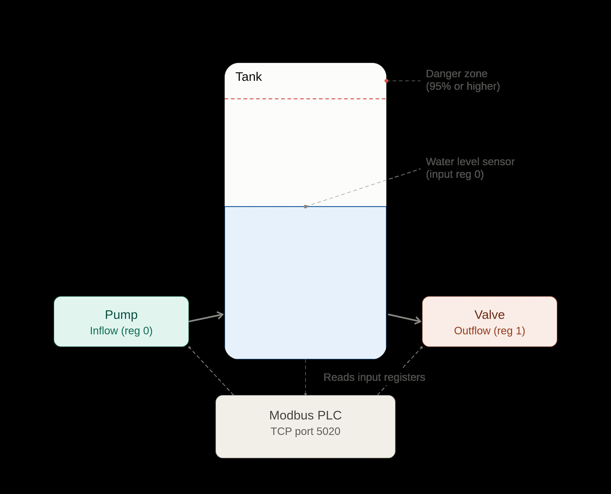

# SafeCheck Plant Server

Team: SafeCheck_TrackE
Project: ICSC (International Cybersecurity Conference) Hackathon 2026

This repository contains the plant-side simulation for the SafeCheck system: a lightweight, Modbus-based industrial control environment used to emulate a water tank, pump, and valve system. The plant server exposes register-based telemetry and control points so that a backend or legitimate client can interact with it in a realistic, testable way without needing full physical hardware.

The aim is to mimic the behavior of a simple industrial process control system:

- a tank holds water
- a pump can raise the water level
- a valve can lower it
- a danger state is triggered when operating conditions become unsafe
- all telemetry is exposed over Modbus TCP

---

## 1. What system is being replicated?



This project simulates a basic industrial process controller for a water tank, similar in spirit to SCADA/PLC-like environments used in manufacturing, water treatment, or industrial safety monitoring.

In the simplified model:

- the pump is a control actuator
- the valve is a control actuator
- the water level is a physical measurement by means of `Sensors`
- Modbus registers act as the interface between the plant and external clients
- the server emulates the sensor/control layer that a monitoring or attack platform would interact with

This is not a real plant or physical device. It is a faithful simulation designed for cybersecurity research, event generation, and testing of command/control flows, register manipulation, and operational safety logic.

---

## 2. Project structure

```text
plant/
├── README.md
├── run.py                     # entry point for starting the plant server
├── pyproject.toml            # project metadata and dependencies
├── requirements.txt          # dependency fallback
├── logs/                     # session log files created by the logger
├── server/
│   ├── __init__.py
│   ├── config.py             # environment-based runtime configuration
│   ├── logger.py             # session-aware logger setup
│   ├── modbus_server.py      # Modbus TCP server and tick loop
│   ├── physics.py            # Tank state and danger logic
│   └── registers.py          # shared Modbus register contract
└── uv.lock
```

---

## 3. Modbus register contract

The system exposes a simple register map that acts like a shared contract between the plant, backend, and client systems.

### Holding registers (writable by clients)

- Register 0: `PUMP_COMMAND_REGISTER`
  - 0 = pump off
  - 1 = pump on
- Register 1: `VALVE_COMMAND_REGISTER`
  - 0 = valve closed
  - 1 = valve open

### Input registers (readonly sensor/state data)

- Register 0: `WATER_LEVEL_REGISTER`
  - current tank water level as an integer percentage
- Register 1: `PUMP_STATUS_REGISTER`
  - 0 = pump off
  - 1 = pump on
- Register 2: `VALVE_STATUS_REGISTER`
  - 0 = valve closed
  - 1 = valve open

These definitions are centralized in [server/registers.py](server/registers.py) so that all components use the same register mapping.

---

## 4. Server module details

### 4.1 `server/config.py`

This config module reads runtime settings from environment variables with safe defaults.

Default values:

- `PLANT_HOST` = `0.0.0.0`
- `PLANT_PORT` = `5020`
- `PLANT_TICK_INTERVAL` = `1.0`
- `PLANT_DANGER_LEVEL_THRESHOLD` = `95.0`
- `PLANT_DANGER_PUMP_VALVE_SECONDS` = `5`

This keeps the plant from hardcoding values directly in logic, and makes it easy to run in different environments.

### 4.2 `server/physics.py`

This module defines the tank model.

The `TankState` object holds:

- `water_level`
- `pump_state`
- `valve_state`
- `is_in_danger`

The tick logic advances the simulation by one step:

- pump on and valve closed => water rises
- valve open and pump off => water falls
- both active together => mostly neutral net effect

The danger logic is separate from the Modbus layer and keeps the plant simulation pure. It sets `is_in_danger` when:

- pump is on while valve is closed, or
- water level is at or near the configured danger threshold while valve is closed

This behavior is intentionally decoupled from external alerting logic.

### 4.3 `server/modbus_server.py`

This is the actual Modbus TCP server implementation.

Responsibilities:

- initialize the live SimDevice/register map
- mirror the tank state into Modbus input registers
- accept writes to holding registers and update the current tank state
- run a periodic tick loop to change water level over time when the pump/valve state dictates
- serve Modbus on the configured host/port

This gives a realistic control-plane endpoint that can be connected to with standard Modbus clients.

### 4.4 `server/logger.py`

The logger module creates a timestamped session file under the project `logs/` directory.

Example log file name:

```text
logs/session_20260828_200431.log
```

Log format:

```text
2026-08-28 20:04:31 | INFO | plant.server | tick -> water_level=51.0 pump=True valve=False
```

This is a standard structured format:

- timestamp
- log level
- logger name
- message

This makes it easy to trace plant behavior during demonstration, debugging, and validation runs.

### 4.5 `run.py`

This file is the main entry point for the plant component. It simply starts the Modbus server application.

Command:

```bash
uv run python run.py
```

---

## 5. How to set up the project

### Prerequisites

- Python 3.13+
- [UV](https://docs.astral.sh/uv/) package manager installed on your system
- a working terminal in the cloned repository

### Clone and setup

```bash
git clone http://github.com/zimcodes1/SafeCheck/
cd SafeCheck/plant
uv sync
```

If the environment is not already created, UV will create a project virtual environment and install dependencies from `pyproject.toml`.

If you want to install the dependency list more explicitly:

```bash
uv pip install -r requirements.txt
```

### Run the plant server

```bash
cd SafeCheck/plant
uv run python run.py
```

This starts the Modbus TCP service on the default host/port:

- host: `0.0.0.0`
- port: `5020`

## 6. Operational notes for demos and development

- The plant uses Modbus TCP and therefore expects clients to connect to port `5020` by default.
- Water level values are integer percentages, so levels are easy to reason about in logs and dashboards.
- The module is intentionally simplified to emulate a real industrial control environment without adding unnecessary complexity.
- The logger produces one file per session, which makes it easier to trace a single run and compare repeated trials.

---

## 7. Why this matters for SafeCheck_TrackE

For SafeCheck_TrackE at the ICSC Hackathon 2026, this plant module acts as the industrial simulation layer that other components can target:

- the backend can receive telemetry or command events
- a legitimate operator client can interact with the tank state
- adversarial or malicious clients can attempt to manipulate control registers
- the logging and state model allow debugging behavior and demonstrating realistic attack/defense scenarios

In short, the plant server is the control-system simulation layer that makes the broader SafeCheck demo realistic, analyzable, and testable.

---

## 8. Quick start summary

```bash
cd SafeCheck/plant
uv sync
uv run python run.py
```

Then connect from a Modbus client using:

- host: `127.0.0.1` or the configured server host
- port: `5020`

For logs, check the `logs/` directory after startup.

---

## 9. Notes for future contributors

If you are contributing to this module:

- keep `server/registers.py` as the single register contract
- keep the physics model independent of Modbus transport
- keep the server logic focused on I/O and lifecycle management
- prefer writing verification scripts before making major changes
- keep logs useful and human-readable

This project is intentionally modular so it can evolve from a simple plant simulator into a richer industrial-control environment without losing clarity.
